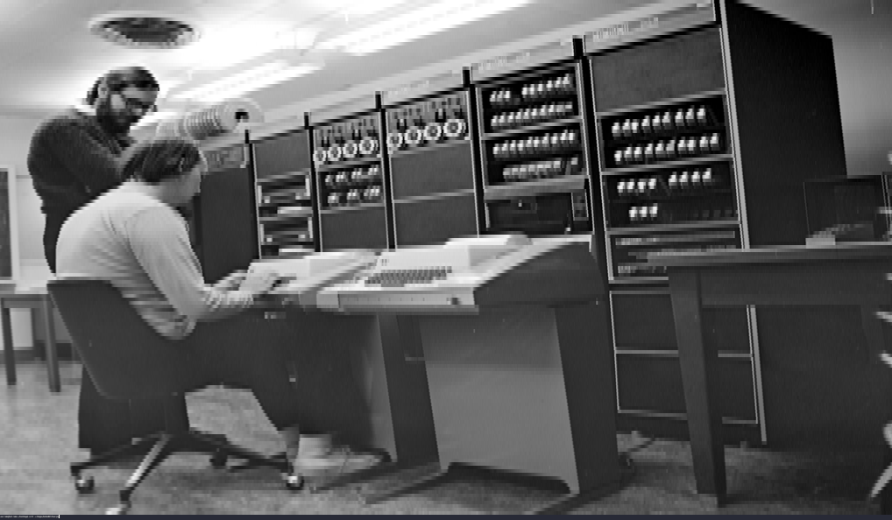

# AnsiImage

AnsiImage is a Simple Unix terminal image viewer written in Python that utilizes ansi escape sequences to render the image into the terminal.

[Unix license plate](https://commons.wikimedia.org/wiki/File:UNIX-Licence-Plate.JPG)

## Requirements

- Unix like system
- Python >= 3.9
- Support to ansi escape sequences and [24bit color](https://en.wikipedia.org/wiki/Color_depth)
- [Pillow](https://github.com/python-pillow/Pillow)

## Arguments
- `image		    → path of the image`
- `-h,   --help     → show this help message and exit`
- `-v,   --version  → show program's version number and exit`

[Bill gates mugshot](https://commons.wikimedia.org/wiki/File:Bill_Gates_mugshot.png)

### `I recommend decreasing the font size to allow more characters on screen`

[Ken and Ritchie togheter 1](https://commons.wikimedia.org/wiki/File:Ken_Thompson_and_Dennis_Ritchie--1973.jpg)

# How does it work?

### It works by replacing every single RGB pixel to an ansi escape sequence e.g:
### `(255, 101, 202)` RGB Pixel will be replaced as `ESC[48;2;255;101;202m `

[Ken and Ritchie togheter 2](https://www.bell-labs.com/usr/dmr/www/picture.html)

## Made by [Sivefunc](https://gitlab.com/sivefunc)
## Licensed under [GPLv3](LICENSE)
